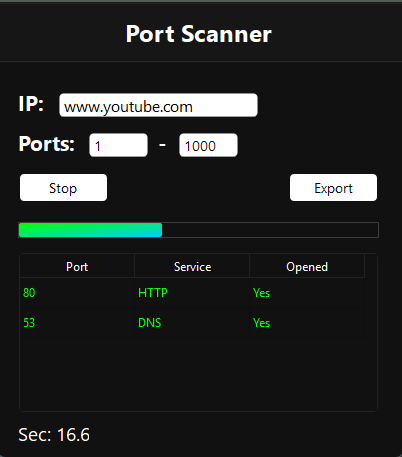

# Port Scanner
A simple and fast TCP port scanner with a UI build using Python 3.14 and PyQt6.

## Features
- Multithreading
- Export to CSV
- UI

## Libraries
- PyQt6
- socket
- concurrent.futures

## Screenshot

## License
MIT License
